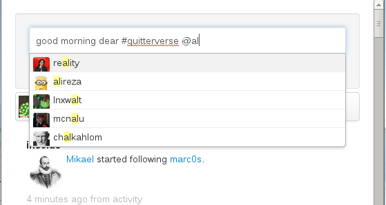
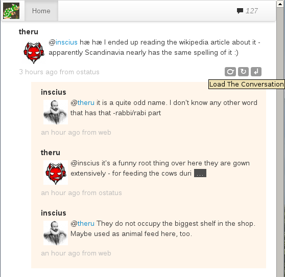
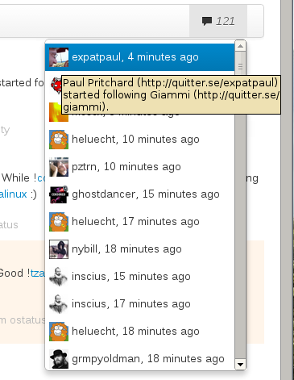
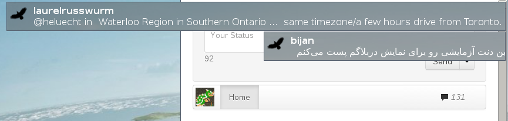
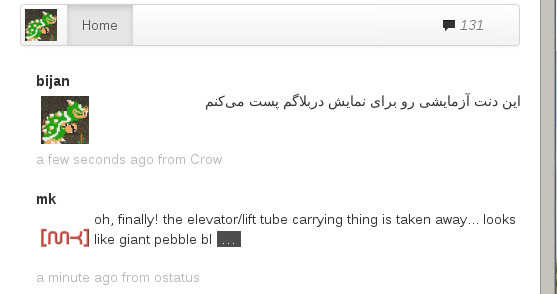
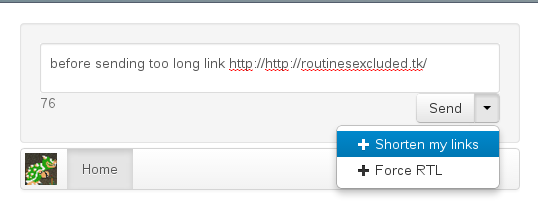
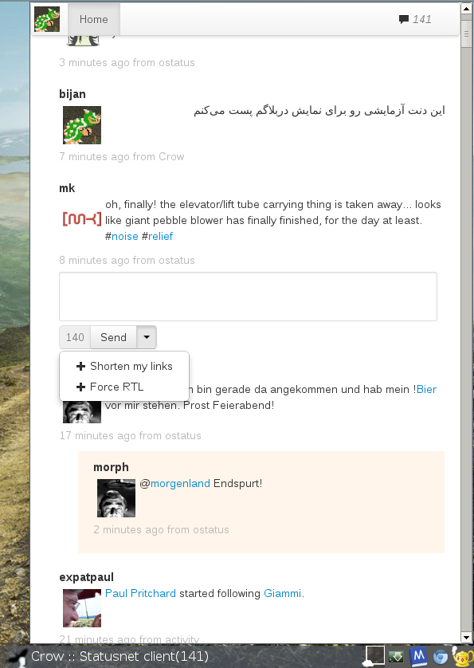
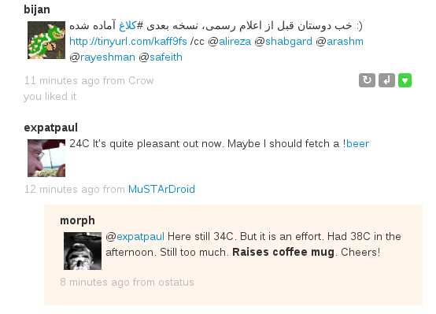

Crow, a StatusNet client

[**crow**](https://github.com/bijanebrahimi/crow) is a StatusNet microblogging client. i decided to create [another client](http://federation.skilledtests.com/Statusnet_clients.html) just because i needed one which can be easy to contribute to and fast to grow and lots of crazy features. i choosed `HTML` and `javascript` for it's user interface since it's very flexible and `python` for a small web server which acts as a proxy between the user interface and statusnet federated server. currently it lacks the program to run the interface independently (maybe webkit) and needs to be run on a web browser like an web application. current version is 0.0.2 which is still an alpha version :) use it at your own risk

* updated: version 0.0.2-1 released fixing [this](http://sn.jonkulp.net/conversation/160516#notice-277899) error
* updated: current version is 0.0.3

<!-- Content Breaker -->

## Requirements

crow is written in `python 2.7+` and `javascript` and `HTML`. so you may only need to get some requirement of python. 

In Debian/Ubuntu friends:

        sudo apt-get install python-pip python-notify
        sudo pip install tornado

In Fedora:

        sudo yum install python-pip python-notify
        sudo python-pip install tornado

## Run

to get the latest code, you can download the source code from [here](https://github.com/bijanebrahimi/crow) or suggest you to clone the project on your computer which enables you to update more frequently as project grows:

        mkdir crow-src
        cd crow-src
        git clone https://github.com/bijanebrahimi/Crow.git ./

before running crow, you must know that crow is actually an small web server which listens on port `8888` and serves as an proxy between you and StatusNet federated service. to run crow, you first need to run the local web service:

        chmod +x run.py
        ./run.py

after running the llocal web server, you now can open the `http://127.0.0.1:8888/` on your browser. many modern browser like Google Chrome and Firefox supports application mode which lets you open web application separately. that way, the browser hides the menu and tabs and makes the web application looks like a native application.

to do that in Chromium (Google Chrom+):

        chromium --app=http://127.0.0.1:8888/

and in iceweasel (Firefox):

        iceweasel -chrome http://127.0.0.1:8888/

## Screenshots

anywhere after `@` character, list of your friends pops up for better mentioning your friends

crow is conversational based. it means new notices will be put to the conversation they belong for better continueing the conversations

along side the conversational base of crow, the new notices will be listed on the stream menu which helps you follow the recent hapenning

notifications are done using `pynotify`

crow has [almost] full RTL support. 

plugins helps you do things like shortening long URLs or forcing your notices to be RTL to better be shown anywhere, specially when your friends do not have good RTL support

the main window screenshot of crow, 0.0.2

added favorite button in 0.0.3

user popover profile view in 0.0.3

# CHANGELOG

version 0.0.1

* project started

version 0.0.2

* added desktop notification (pynotify)
* added desktop notification highlight support
* added mention suggestion/autocompletion after @
* add mimetype check for notices attachments
* added text/html attachment loading via ajax
* keep retrieved notices in memory (sorted)
* many small javascript UI improvements
* fixed: showing duplicated notices
    
version 0.0.2-1

* fixed textbox getting blank when new notices arrives

version 0.0.3

* notices in viewport (while scrolling) are flagged as read automatically
* added popup for user info over user's avatar
* added favorite button
* fixed some css errors

# License

crow is published under GPL version 3.0 or later license but the libraries used in project may be different, for that you can check the header of each library. but basically, crow is a Free and OpenSource software. you can fork the project and improve the code as longs as you keep the code Free :)

P.S: you can also download the markdown source of this blog entry from [here](crow.md). GFDL licensed by Bijan Ebrahimi
